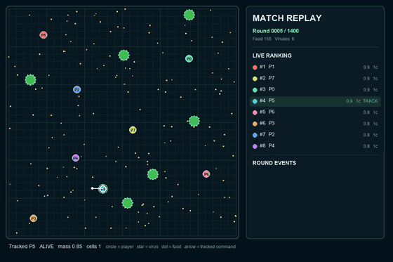
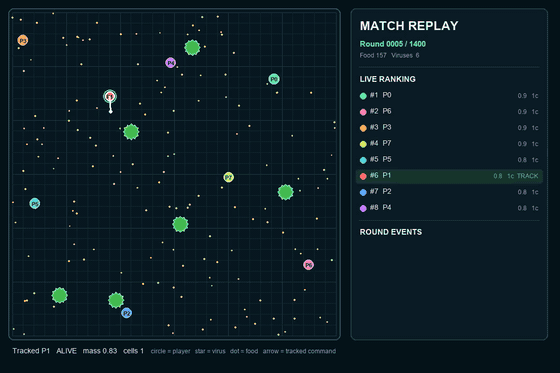

# agario-competitor

SYNCS 2026 Agar.io competition用の提出botです。リポジトリは現在の提出戦略
`replay_distilled` の実装・ビルド・最小限の回帰確認だけに絞っています。

## Structure

```text
bots/
├── my_bot.py                 local entry for the submitted strategy
├── baseline_bot.py           semantic base policy used for comparisons
├── runtime.py                simulator query loop
├── telemetry.py              benchmark metrics
├── simulation/rules.py       shared engine rules
└── strategies/
    ├── base.py               strategy contract and decision type
    ├── features.py           visible-state helpers
    ├── semantic_potential.py base policy
    ├── asset_preservation.py post-split asset guard
    └── replay_distilled.py   submitted policy
scripts/
├── build_submission.py       create dist/my_bot.py
├── benchmark_simulations.py  compare mean final mass
├── run_fast_simulation.py    lightweight local runner
└── run_seeded_engine.py      deterministic engine adapter
tests/                        tests for the files above only
knowledge/                    evidence and historical strategy decisions
```

Large replay files and generated match workspaces belong under ignored
`.agario/`; they are not source files.

## Official match evidence

The submitted bot placed 3rd out of 71 teams as team 73. Two official
first-place matches from submission 53 are preserved below. The GIF previews
play in this README; click either preview or the MP4 link to open the tracked
high-quality replay stored in this repository.

### Match 40742 — 1st place

[](docs/assets/bot-battle/match-40742-official-win.mp4)

Final mass **93.21** · **24 eliminations** ·
[Play high-quality MP4](docs/assets/bot-battle/match-40742-official-win.mp4)

### Match 40806 — 1st place

[](docs/assets/bot-battle/match-40806-official-win.mp4)

Final mass **77.08** · **29 eliminations** ·
[Play high-quality MP4](docs/assets/bot-battle/match-40806-official-win.mp4)

The tracked bot is outlined in white and marked `TRACK` in the live ranking.
The final frame shows the official winner event. Render parameters and exact
values derived from the downloaded official event logs are recorded in the
[video manifest](docs/assets/bot-battle/manifest.json). The large source event
logs remain intentionally excluded from Git.

The runtime and submission dependency flow is intentionally one-way:

```text
engine query -> runtime -> ReplayDistilledStrategy
                              ├── SemanticPotentialStrategy
                              └── AssetPreservationLayer
             <- move decision <-
```

## Setup

Install [uv](https://docs.astral.sh/uv/getting-started/installation/), then run:

```bash
uv sync --frozen
uv run pytest -q
```

The lockfile uses `agario-kit==2026.1.15`.

## Build the submission

The portal accepts one Python file:

```bash
uv run python scripts/build_submission.py
uv run python -m py_compile dist/my_bot.py
```

Upload `dist/my_bot.py`. The file is generated and intentionally ignored by Git.

## Local checks

Run the bot directly in the official simulator:

```bash
uv run simulation 1:bots/my_bot.py 7:bots/baseline_bot.py --headless
```

Run repeated seeded matches and aggregate final mass:

```bash
uv run python scripts/benchmark_simulations.py --trials 8 --jobs 1
```

The benchmark tracks slot 0 and ranks changes by mean final mass. Its default
opponents use `SemanticPotentialStrategy`, the base policy underneath the
submitted replay residual and asset-preservation layers.

## Change policy

- Keep engine-independent decisions in `bots/strategies/`.
- Keep protocol handling in `bots/runtime.py`.
- Keep engine constants and shared physics in `bots/simulation/rules.py`.
- Update `scripts/build_submission.py` when the submission dependency set changes.
- Record measured strategy decisions and benchmark results in `knowledge/`.
- Before submitting, run tests, build, compile, and at least one local simulation.
